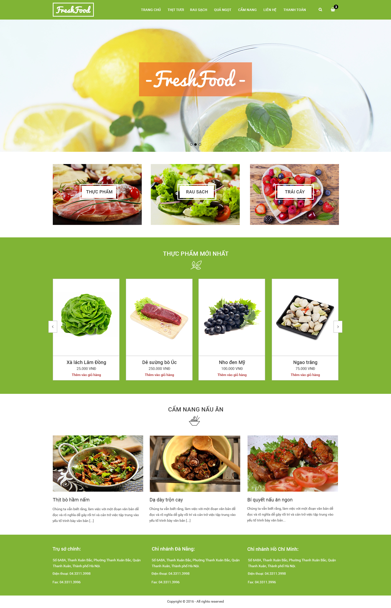
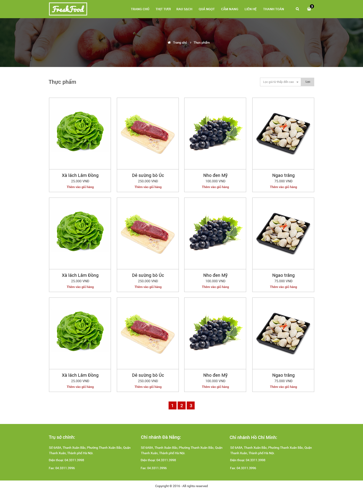
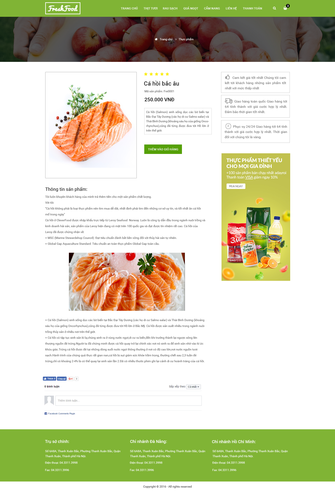
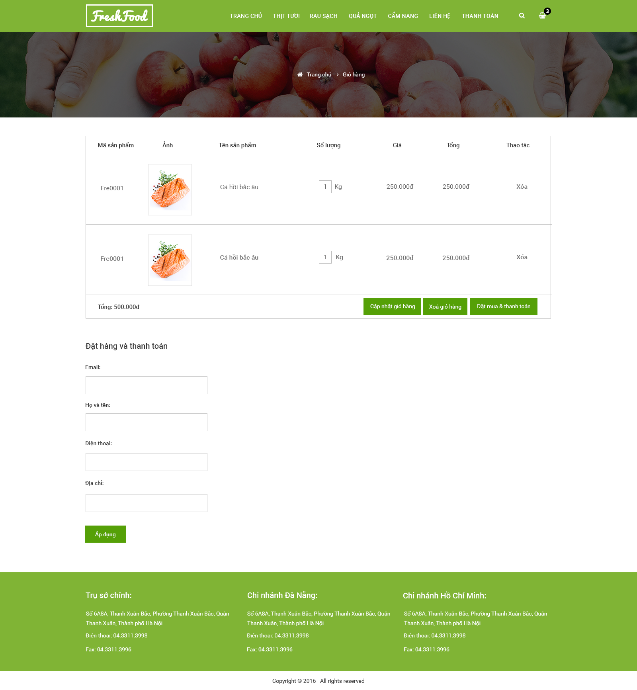
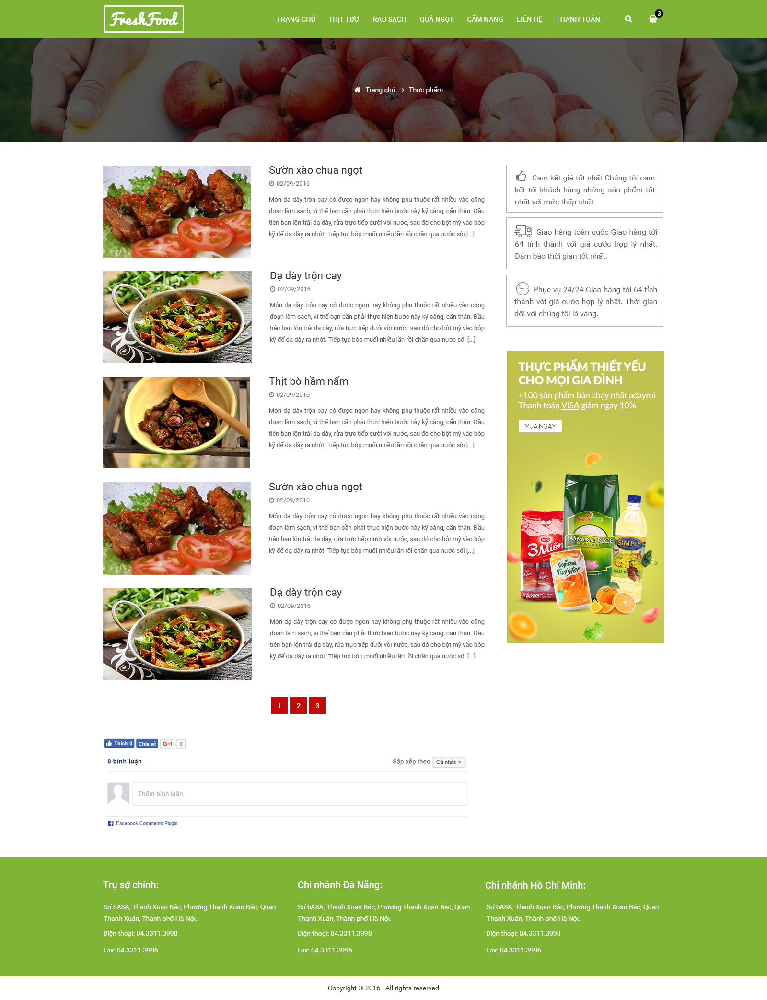
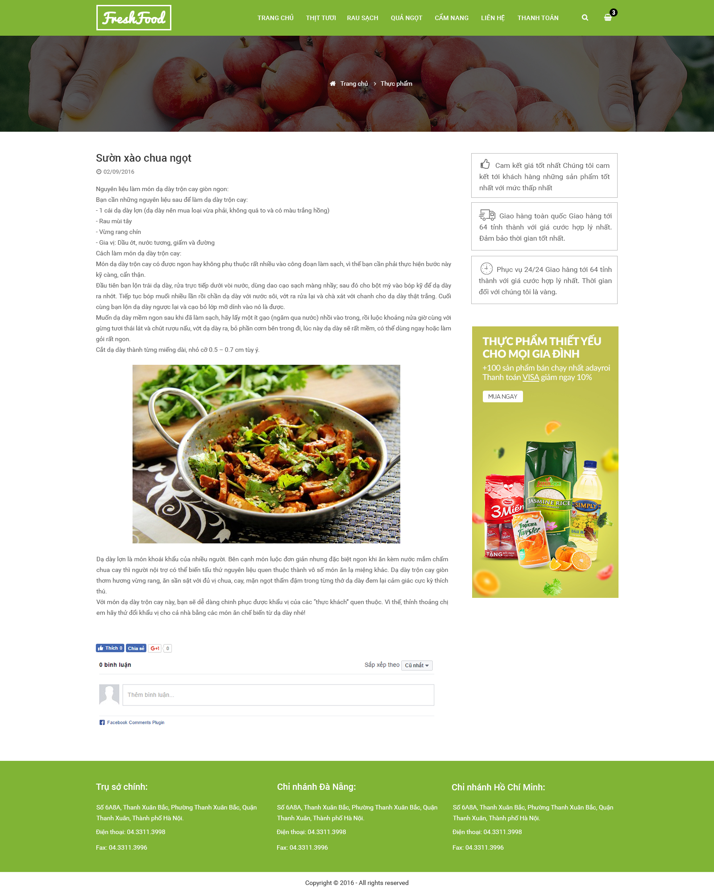

# **Thông tin về project.** #

## Project cắt HTML, CSS, JS từ file design PSD. ##

**_Dự án chuyển file design PSD. Teamplate website bán hàng_**
*Nguồn file PSD là free được share bởi ảnh Phan Văn Cương [Link bai chia se:](http://laptrinh.unitop.vn/tang-file-psd-giao-dien-website-mien-phi/)*

## Công cụ cần thiết cho việc coding. ##

- VSCode, github,...
- Sản phẩm được viết theo chuẩn BEM, responsive,...
- Demo ảnh home page cho file psd: 